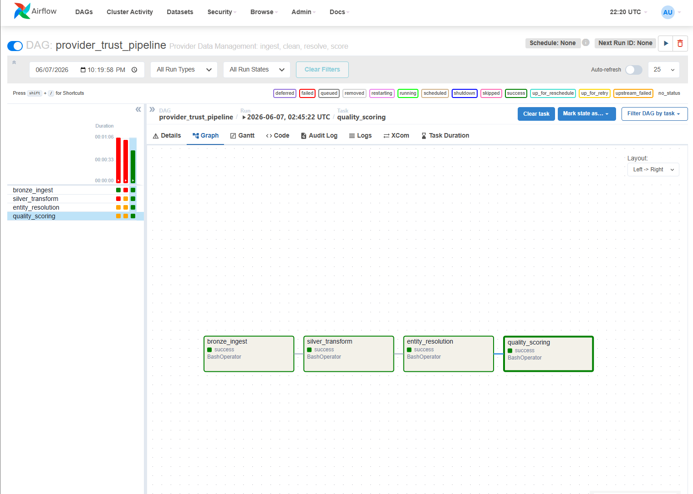
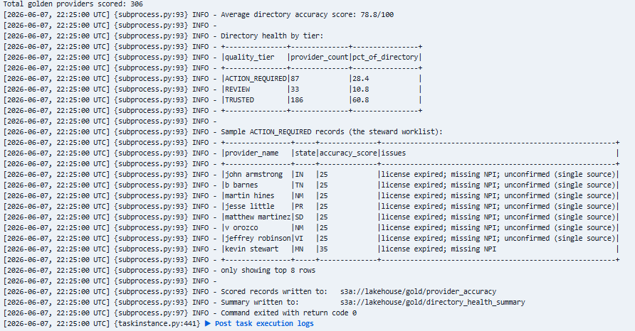
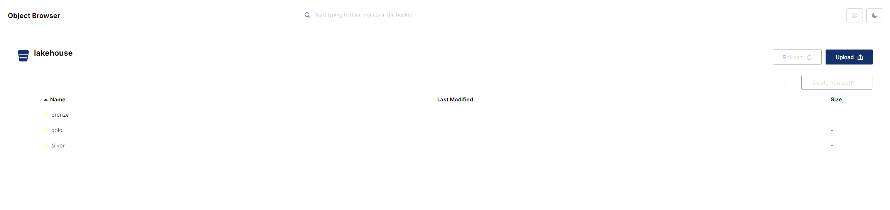

# ProviderTrust — Provider Data Management Lakehouse

A production-shaped data engineering pipeline that ingests provider records from
multiple source systems, resolves duplicates into trustworthy "golden records,"
and scores each record for **directory accuracy** , the core data challenge a
health insurer faces under provider-directory accuracy regulations.

Built on an **AWS-portable, Databricks-compatible** stack: object storage,
Spark, a medallion (Bronze/Silver/Gold) lakehouse, and Apache Airflow
orchestration, all containerized and runnable locally with one command.



---

## Why this project

Health insurers maintain directories of tens of thousands of providers sourced
from many systems that rarely agree, the same physician appears with different
name formats, addresses, and identifiers, or with no shared key at all.
Inaccurate directories cause "ghost networks" (members unable to reach a listed
provider) and carry regulatory and financial risk.

**ProviderTrust** treats this as a master-data-management problem: it unifies
messy multi-source provider data into a single, scored, governed directory and
flags exactly which records need a data steward's attention.

---

## Results

From a multi-source load of synthetic + real provider data:

| Metric | Value |
|---|---|
| Source records ingested | **421** |
| Golden records after resolution | **306** |
| Duplicate records merged | **114** (~98% of expected duplicates resolved) |
| Average directory accuracy score | **78.8 / 100** |
| Directory health | **60.8% Trusted · 10.8% Review · 28.4% Action Required** |



The pipeline doesn't just deduplicate — it produces a **steward worklist**
ranking exactly which providers need fixing and why (expired license, missing
identifier, single-source, incomplete address).

---

## Architecture
```text
 SOURCE SYSTEMS            BRONZE              SILVER                 GOLD
 ---------------           ------              ------                 ----
 system_a  (creds)   -->   raw data,     -->   standardized   -->     golden_providers
 system_b  (claims)  -->   stored as-is        + deduped via          provider_accuracy
 NPI Registry (API)  -->   with lineage        entity resolution      directory_health

 [ ingest ]              [ immutable ]        [ clean + match ]      [ scored + curated ]

        Orchestrated end-to-end by Apache Airflow (Airflow -> Spark via docker exec)
```


Orchestrated end-to-end by Apache Airflow (Airflow → Spark via docker exec)
**Medallion layers**
- **Bronze** — raw source files preserved exactly as received, with lineage columns. Never mutated, so the pipeline can always be replayed.
- **Silver** — names and addresses standardized (titles/suffixes stripped, formats normalized), records unified across sources, data-quality flags applied. Originals retained for auditability.
- **Gold** — entity resolution merges records into golden providers; an accuracy-scoring layer grades each record and produces a directory-health summary.



---

## Entity resolution

The core logic. Each record is assigned a **match key**, strongest signal first:

1. **NPI present** → match on the National Provider Identifier (authoritative).
2. **NPI missing** → fall back to a **phonetic (Soundex) key on surname + state**,
   so name variants like *"C. Braun"* and *"Cheryl Braun"* in the same state
   resolve together — without merging different people across states.

Records sharing a match key are merged via a survivorship rule (prefer records
with an NPI, then most recent), and each golden record carries provenance:
how many source records merged into it and which systems contributed.

This rule-based, explainable approach was a deliberate choice — every merge
decision can be justified, which matters in a regulated, audited domain.

---

## Data quality & directory accuracy scoring

Each golden record starts at 100 and loses points by business severity:

| Issue | Deduction | Rationale |
|---|---|---|
| License expired | −40 | A member routed to an unlicensed provider is a serious failure |
| Missing NPI | −25 | Record can't be authoritatively verified |
| Incomplete address | −20 | Member can't physically locate the provider |
| Single-source | −10 | Unconfirmed by a second system, lower confidence |

A **business-rule override** forces any expired-license record into
`ACTION_REQUIRED` regardless of score — separating soft scoring from hard
compliance rules. Records are bucketed into **Trusted / Review / Action Required**
tiers for an operational audience.

---

## Tech stack

| Layer | Technology | Production equivalent |
|---|---|---|
| Object storage | MinIO (S3-compatible) | AWS S3 |
| Processing | Apache Spark 3.5 / PySpark | Databricks |
| Storage format | Delta-style Parquet | Delta Lake |
| Orchestration | Apache Airflow | Databricks Workflows |
| Ingestion | boto3, REST API (NPI Registry) | AWS SDK / API ingestion |
| Containerization | Docker Compose | — |

The code is written to lift onto **AWS + Databricks** with configuration changes
only , the storage endpoint and credentials in `config/settings.py` are the
sole environment-specific values.

---

## Project structure
```
provider-trust/
├── docker-compose.yml          # MinIO + Spark + Postgres + Airflow
├── Dockerfile.airflow          # custom Airflow image (adds Docker CLI)
├── requirements.txt
├── config/
│   └── settings.py             # central config (local ↔ cloud)
├── data_generator/
│   ├── generate_providers.py   # synthetic multi-source provider data
│   └── fetch_npi_api.py        # real provider data from NPI Registry API
├── pipeline/
│   ├── spark_session.py        # Spark session wired to S3-style storage
│   ├── bronze_ingest.py        # raw → Bronze
│   ├── silver_transform.py     # standardize + unify → Silver
│   ├── gold_entity_resolution.py  # dedupe → golden records
│   └── gold_quality_scoring.py    # accuracy scoring + summary
├── airflow/
│   └── dags/
│       └── provider_trust_dag.py  # orchestrates the full pipeline
└── docs/                       # screenshots
```
---

## How to run

**Prerequisites:** Docker Desktop.

```bash
# 1. Start the platform (MinIO, Spark, Postgres, Airflow)
docker compose up -d

# 2. Create the storage bucket 'lakehouse' in the MinIO console
#    (http://localhost:9001, login from your .env)

# 3. Generate source data
python data_generator/generate_providers.py
python data_generator/fetch_npi_api.py        # optional: real NPI Registry data

# 4. Run the pipeline — either:
#    (a) trigger the DAG in Airflow (http://localhost:8081), or
#    (b) run each stage directly:
docker exec spark python3 /opt/app/pipeline/bronze_ingest.py
docker exec spark python3 /opt/app/pipeline/silver_transform.py
docker exec spark python3 /opt/app/pipeline/gold_entity_resolution.py
docker exec spark python3 /opt/app/pipeline/gold_quality_scoring.py
```

**Services:** MinIO console `:9001` · Spark UI `:8080` · Airflow `:8081`

---

## Engineering decisions worth noting

- **Orchestrator/compute separation** — Airflow orchestrates but delegates Spark
  jobs to a dedicated Spark container via the Docker socket, mirroring how
  managed orchestration drives separate compute in production.
- **Quality gates as first-class stages** — bad data fails the pipeline rather
  than silently corrupting the Gold layer.
- **Explainable matching over black-box** — every merge is traceable, suited to
  a regulated domain.
- **Immutable Bronze** — raw data is never mutated, so any run is reproducible.

---

## Roadmap

- Streaming change-detection layer (Kafka) for real-time directory freshness
- Schema-contract validation at ingestion (Pydantic / Great Expectations)
- Deployment to AWS (S3 + EMR/Databricks) with Terraform
- Probabilistic matching (ML) to complement the rule-based resolver

---

## Note on data

All synthetic data is generated locally and contains no real personal
information. Real provider data is fetched from the public
[NPPES NPI Registry API](https://npiregistry.cms.hhs.gov/api-page).